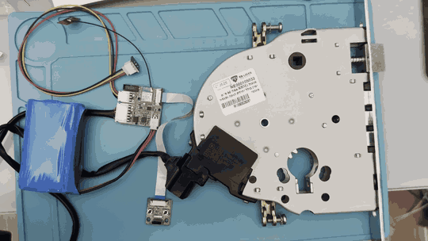
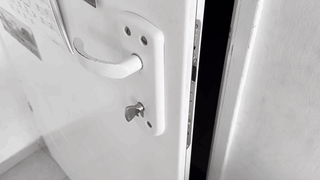
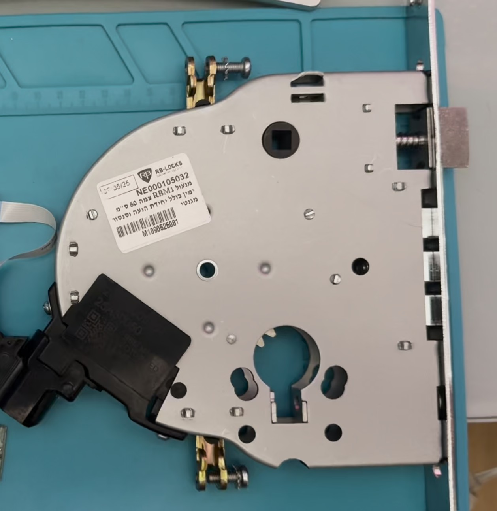
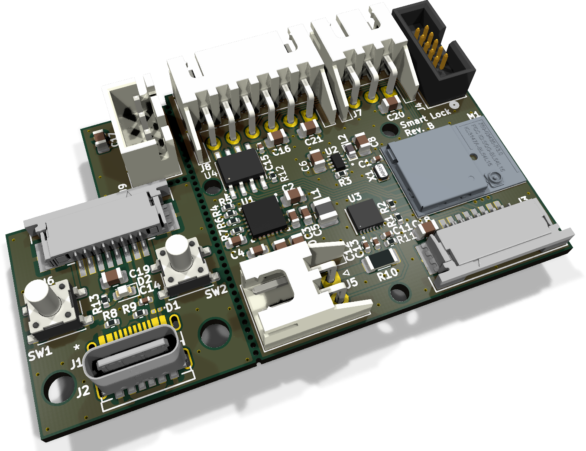
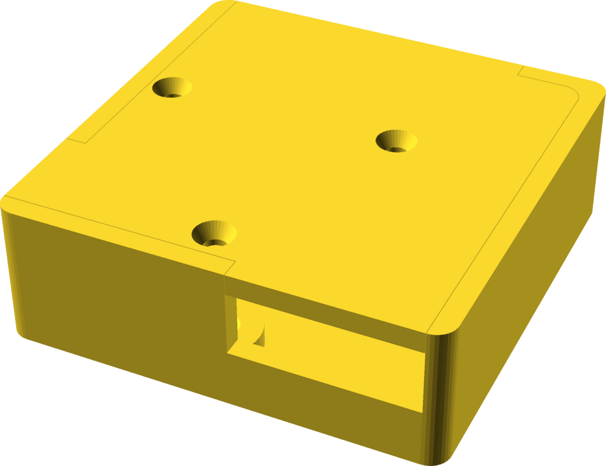
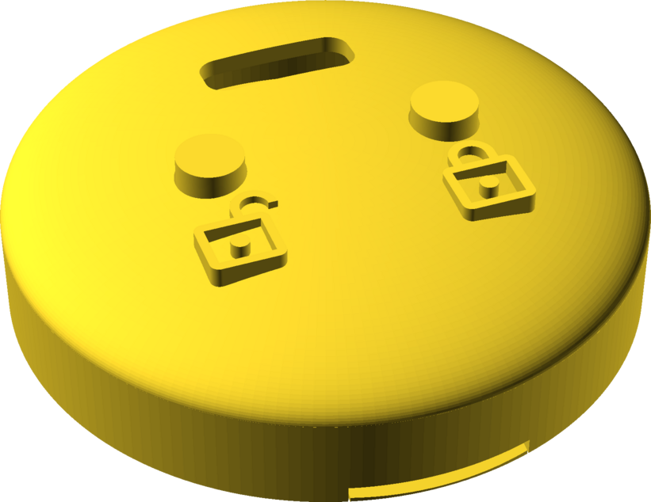
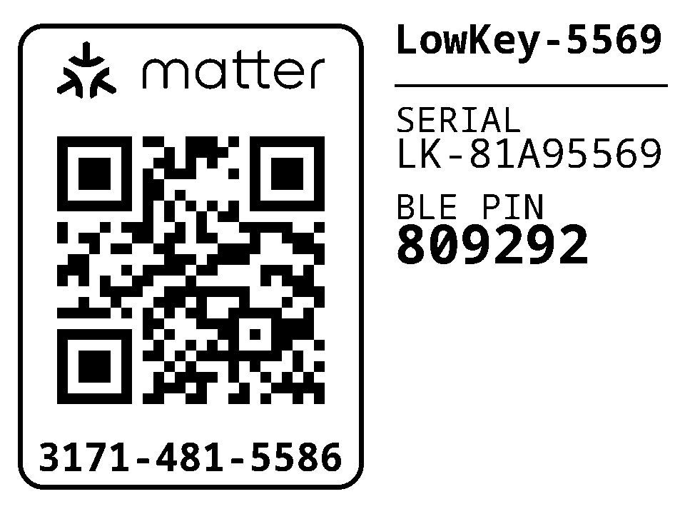

# LowKey

A battery-powered smart lock controller for a motorised deadbolt, built on the
Nordic **nRF54L15** with the nRF Connect SDK.

It speaks **Matter over Thread** and a **custom BLE GATT service at the same
time**, on one Bluetooth controller. The two are not alternatives selected at
build time - they run concurrently, each with its own advertising set and its
own Bluetooth identity, so the lock stays controllable over BLE when the Thread
mesh or the Matter controller is down, and its BLE bonds survive Matter
commissioning and Matter factory resets.

| On the bench | Installed in a door |
| --- | --- |
|  |  |

## Features

- **Three distinct actions**, matching what a mortise deadbolt can actually do:
  lock, unbolt (retract the bolt, spring latch still holds the door), and open
  (retract the bolt *and* hold the latch back so the door can be pushed).
  These map to the Matter `LockDoor`, `UnboltDoor` and `UnlockDoor` commands.
- **Position tracked from the bolt, not from the motor.** The lock body's two
  magnetic end-stop sensors are monitored continuously, so operating the lock
  with a physical key updates the reported state exactly like a remote command
  does.
- **Jam detection** - the motor stops and the lock reports jammed, with a Matter
  `DoorLockAlarm` event, if an end-stop is not reached in time.
- **Door position sensor**, reported as a Matter `DoorStateChange`.
- **Battery monitoring** with a MAX17205 ModelGauge m5 fuel gauge, plus charger
  connected/complete status.
- **Firmware update** over both Bluetooth SMP (MCUmgr) and Matter OTA, sharing
  one MCUboot slot pair with LZMA-compressed images.
- **Per-device provisioning** - serial number, BLE pairing passkey, Matter
  discriminator and SPAKE2+ verifier in a dedicated flash partition that OTA
  never touches.
- **Task watchdog** with a channel per critical thread.

## Hardware

### Lock body



The mechanism is a **Rav Bariach RBM1**, a motorised mortise lock. The motor
unit and the magnetic sensors for the two bolt end-stops come built into the
body. The controller only has to drive the motor and read the sensors, all
through one 6-pin harness:

| Pin | Signal |
| --- | --- |
| 1 | 3.3 V (sensor supply) |
| 2 | GND |
| 3 | Unlocked end-stop |
| 4 | Locked end-stop |
| 5, 6 | Motor |

See [Adapting to a different lock body](#adapting-to-a-different-lock-body) if
yours is different.

<br clear="right">

### Electronics



One KiCad project holds three boards, panelised with mouse bites:

- **Main board**: the **Ezurio BL54L15** module (nRF54L15, with an MHF4
  connector for an external antenna, so there is no RF switch to manage),
  charger, regulator, fuel gauge, motor driver, and connectors for the
  battery, the lock harness, the door sensor and SWD.
- **UI board**: the two keys, the status LED and the USB-C charging port. It
  connects to the main board over an 8-way FFC.
- **Door sensor board**: a single Hall sensor with a 3-pin JST XH cable to
  the main board. It also carries an alternative footprint for a Coto RR123
  magnetoresistive sensor, which is not fitted.

Power comes from a 2S Li-ion pack, two 18650 or 21700 cells in series, on a
2-pin JST XH connector. See [Battery life](#battery-life) for what to expect
from each.

| Part | Role |
| --- | --- |
| Ezurio 453-00044R (BL54L15) | nRF54L15 module |
| TE 2344656-6 | External 2.4 GHz antenna |
| TI BQ25886 | 2S battery charger from USB-C, 1.03 A charge current (ITERM 103 mA) |
| TI TPS629203 | 3.3 V buck regulator |
| ADI MAX17205 | 2S fuel gauge, I²C `0x36`, 10 mΩ shunt |
| TI DRV8871 | H-bridge motor driver |
| Honeywell SL353LT | Door sensor, on its own board |

- [**Schematic (PDF)**](hardware/pcb/smart-lock.pdf)
- [KiCad project](hardware/pcb/) (KiCad 10). Custom 3D models are embedded
  in the board file, so the 3D viewer needs no extra libraries.

### Enclosures

| Controller | UI |
| --- | --- |
|  |  |
| [`controller.stl`](hardware/3d/controller.stl), from [`controller.scad`](hardware/3d/controller.scad) | [`ui.stl`](hardware/3d/ui.stl), from [`ui.scad`](hardware/3d/ui.scad) |

- **Controller**: a 42 × 42 × 13.8 mm box for the main board. It has openings
  for the lock harness, the battery lead and the UI cable, and closes with
  three M2 countersunk screws into heat-set inserts.
- **UI**: a Ø34 mm dome for the UI board, with lock and unlock icons embossed
  beside the two key caps. It closes with two M2 countersunk screws into
  heat-set inserts.

Both enclosures use 3.45 mm outer-diameter M2 inserts. Each STL holds every
part of its enclosure (base, lid and, for the UI, the key caps) as separate
bodies; split them into objects in your slicer. The `show_*` variables at the
top of each `.scad` export a single part.

### Regenerating the outputs

The PDF, the renders and the STLs are committed so they can be viewed on
GitHub. After changing a source, regenerate them with:

```sh
make -C hardware          # everything
make -C hardware pcb      # schematic PDF and board render (KiCad 10)
make -C hardware 3d       # STLs and enclosure renders (OpenSCAD)
```

The Makefile finds `kicad-cli`, `openscad` and ImageMagick's `magick` in
`PATH`, in their usual macOS locations, and under `C:\Program Files` from WSL or
Git Bash. Point it at a tool anywhere else with
`make KICAD_CLI=... OPENSCAD=... MAGICK=...`. ImageMagick is optional: it gives
the renders a transparent background and trims them to the model.

OpenSCAD must be a development snapshot with the Manifold backend. The 2021.01
release only has CGAL, which rejects the imported PCB meshes and silently drops
their cutouts, so the Makefile refuses to use it.

## Repository layout

```
boards/shmuelzon/lowkey/   Board definition (revisions A and B) and its DTS bindings
src/                       Application
  ├─ lock_manager.c        Motor drive and the bolt/latch state machine
  ├─ door_monitor.c        Door position sensor
  ├─ battery_manager.c     MAX17205 fuel gauge and charger status
  ├─ ui.c                  Keys and status LED
  ├─ gpio_input.c          Interrupt-driven GPIO inputs, optionally debounced
  ├─ watchdog.c            Task watchdog
  ├─ radio.c               Fans the radio API out to the backends below
  ├─ ble/                  Custom GATT services (CONFIG_LOCK_RADIO_BLE)
  └─ matter/               Clusters and ZAP data model (CONFIG_LOCK_RADIO_MATTER)
scripts/                   Factory-data generation, device label, Intel HEX padding
sysbuild/mcuboot/          MCUboot configuration
pm_static.yml              Flash partition layout
hardware/                  Makefile that regenerates the outputs below
  ├─ pcb/                  KiCad project, schematic PDF and board render
  └─ 3d/                   OpenSCAD enclosures, STLs and renders
docs/                      README media
```

## Getting started

Built against **nRF Connect SDK v3.2.4**.

```sh
# Toolchain and SDK
curl -o ~/bin/nrfutil "https://files.nordicsemi.com/ui/api/v1/download?repoKey=swtools&path=external/nrfutil/executables/x86_64-unknown-linux-gnu/nrfutil&isNativeBrowsing=false"
chmod +x ~/bin/nrfutil
nrfutil install sdk-manager toolchain-manager
nrfutil sdk-manager install v3.2.4
cd ~/ncs/v3.2.4 && west update

# Per-shell environment (needed for west build and west zap-generate)
SDK_VERSION=v3.2.4
source ~/ncs/$SDK_VERSION/zephyr/zephyr-env.sh
eval $(nrfutil toolchain-manager env --ncs-version $SDK_VERSION --as-script)

# Python packages used by the provisioning script
pip install cbor2 intelhex jsonschema pillow pyyaml qrcode
```

## Building

The board has two PCB revisions, selected with the `@` suffix. They differ only
in the motor driver: **rev A** (DRV8837) has an `nSLEEP` enable pin, **rev B**
(DRV8871) sleeps on its own and omits it.

```sh
# Product build: both radios, release
west build --pristine -b lowkey@B/nrf54l15/cpuapp -- -DBOARD_ROOT="$PWD"

# Debug: RTT console and logging
west build --pristine -b lowkey@B/nrf54l15/cpuapp -- -DBOARD_ROOT="$PWD" \
    -DEXTRA_CONF_FILE="overlay-debug.conf"

# One radio only
west build --pristine -b lowkey@B/nrf54l15/cpuapp -d build-ble -- \
    -DBOARD_ROOT="$PWD" -DCONFIG_LOCK_RADIO_MATTER=n -DSB_CONFIG_MATTER=n
west build --pristine -b lowkey@B/nrf54l15/cpuapp -d build-matter -- \
    -DBOARD_ROOT="$PWD" -DCONFIG_LOCK_RADIO_BLE=n
```

Both radios are on by default. There are no `prj_*.conf` protocol fragments -
`CONFIG_LOCK_RADIO_BLE` and `CONFIG_LOCK_RADIO_MATTER` in the project `Kconfig`
carry all protocol-specific configuration, so a build is described by the board
plus those two switches.

Approximate image sizes (of the 810 KiB application slot):

| Build | Flash | RAM |
| --- | --- | --- |
| Both radios | 78 % | 79 % |
| Both radios, debug | 90 % | 80 % |
| Matter only | 72 % | 68 % |
| BLE only | 24 % | 28 % |

Two things that will bite you:

- **Use `-DEXTRA_CONF_FILE`, not `-DOVERLAY_CONFIG`.** Under sysbuild the latter
  is applied to *every* image, including MCUboot, where it breaks image signing
  with a confusing `@PM_MCUBOOT_PRIMARY_SIZE@ is not a valid integer`.
- **`-DSB_CONFIG_MATTER=n` is separate from `-DCONFIG_LOCK_RADIO_MATTER=n`.**
  Sysbuild's Kconfig cannot see the application's, so a Matter-less build still
  emits a `matter.ota` artifact unless you pass both.

### Changing the Matter data model

The files under `src/matter/zap-generated/` are generated from
`src/matter/lock.zap`:

```sh
west zap-gui        # or edit the JSON directly
west zap-generate
```

If you **add or remove a cluster**, force a CMake reconfigure before rebuilding
(`touch CMakeLists.txt`, or build `--pristine`). Cluster-to-source selection
happens at configure time only, so an incremental build fails at link with
something like `undefined reference to MatterPowerSourcePluginServerInitCallback`.

## Flashing

A build produces `build/merged.hex` (MCUboot + signed application) for SWD,
`build/dfu_application.zip` for MCUmgr, and `build/matter.ota` for Matter OTA.

```sh
./scripts/pad_hex.py build/merged.hex
west flash
```

> ### Pad the HEX file first
>
> `scripts/pad_hex.py` pads the last data record of an Intel HEX file to 16
> bytes with `0xFF`. This works around an OpenOCD nRF5 driver issue where the
> RRAMC write buffer is not flushed for a trailing partial block, which
> **silently corrupts the ED25519 signature** at the end of the MCUboot image -
> the device then refuses to boot for no visible reason.
>
> This affects on-board debuggers driven through OpenOCD, including the one on
> the Seeed XIAO nRF54L15. Run it before every flash, on `merged.hex` and on
> `factory_data.hex` alike. It is idempotent.

## Provisioning

Every device needs its own factory data: a serial number, a BLE pairing
passkey, and (for Matter) a discriminator and SPAKE2+ verifier. These live in a
4 KiB `factory_data` partition that firmware updates never overwrite.

```sh
python3 scripts/generate_factory_data.py -o factory_data
./scripts/pad_hex.py factory_data.hex
nrfutil device program --firmware factory_data.hex --core application \
    --options chip_erase_mode=ERASE_RANGES_TOUCHED_BY_FIRMWARE,reset=RESET_SYSTEM
```

Every argument has a default and the per-device secrets are drawn randomly when
not given, so the command above is the whole flow for a development unit. It
writes five files:

| File | Contents |
| --- | --- |
| `factory_data.hex` | The partition image, at the offset and size read from `pm_static.yml` |
| `factory_data.json` | Every generated value **except** the Matter passcode |
| `factory_data.txt` | Matter manual pairing code and QR payload |
| `factory_data.png` | The same QR code as an image |
| `factory_data.sticker.png` | A printable device label: Matter QR and pairing code, BLE name, serial number and BLE passkey |

Archive the `.json` and `.txt` per device - together they are the only record.
Use `--no-matter` for a BLE-only build, and `--help` for the full set of
overrides (`--sn`, `--ble_passkey`, `--passcode`, `--discriminator`,
`--battery_capacity_mah`, the DAC/PAI certificate paths, `--sticker-size`,
`--no-sticker`, …). To reprint the label for a unit provisioned earlier, run
`python3 scripts/generate_sticker.py factory_data`.



*An example label. Its codes were randomly generated and belong to no device.*

> ### The onboarding codes printed at boot are wrong
>
> The Matter passcode is deliberately **not** stored on the device - only the
> one-way SPAKE2+ verifier is, so reading out the flash does not reveal it. The
> firmware therefore cannot rebuild its own onboarding payload and falls back to
> Matter's example passcode, making the `Manual pairing code` and `SetupQRCode`
> lines in its boot log useless:
>
> ```
> [DL]  Setup Pin Code (0 for UNKNOWN/ERROR): 0
> [SVR]*** Using default EXAMPLE passcode 20202021 ***
> ```
>
> **Commission with the codes in `factory_data.txt`.** Pass `--include-passcode`
> if you would rather store the passcode and trust the boot log, at the cost of
> it being readable out of flash.

### Before shipping anything

The stock configuration is a development configuration:

- **Attestation certificates** default to the Matter SDK's *test* DAC/PAI for
  test VID/PID `0xFFF1`/`0x8000`. Production devices need certificates from a
  real PAA. The script warns if you change the VID/PID without supplying them.
- **Images are signed with MCUboot's public development key**, so anyone can
  produce an image this bootloader accepts. Generate your own and point the
  build at it - this cannot be changed after units ship, because MCUboot is the
  immutable first-stage bootloader:
  ```sh
  imgtool keygen -k prod-ed25519.pem -t ed25519
  west build ... -- -DSB_CONFIG_BOOT_SIGNATURE_KEY_FILE="$PWD/prod-ed25519.pem"
  ```
  On nRF54L15, `SB_CONFIG_BOOT_SIGNATURE_USING_KMU` can hold the public key in
  hardware instead of bootloader flash.

## Using the lock

### Keys and LED

The key layout is chosen at build time from devicetree, by whether a `key1`
alias exists:

| | Short press | Long press |
| --- | --- | --- |
| **key0** | Lock | Factory reset (10 s) |
| **key1** | Unbolt | Open for commissioning / pairing (1.5 s) |

On a board with only `key0`, a short press opens the discovery window and the
long press is still factory reset - both are mandatory in every layout, and the
build fails if either is unassigned. Factory reset sits on the *lock* key
deliberately: the key someone leans on when the door will not open is the unlock
one, and ten seconds of that should not wipe the fabric.

| LED | Meaning |
| --- | --- |
| Fast blink (100 ms) | Factory reset fires in 3 seconds - release to abort |
| Slow blink (500 ms) | Discoverable, identifying, or charging |
| Solid | Charge complete |
| Off | Idle |

One press of the discovery key opens an onboarding window on **both** radios and
lets your app pick; the first to complete closes the other. To pair a BLE client
*and* commission to Matter, press it twice, once per path.

### Matter

Endpoint 1 exposes **Door Lock** (with the `Unbolting` and `DoorPositionSensor`
features), **Power Source**, **Identify** and **ICD Management**. There is no
PIN/RFID/user support - the lock has no keypad, and those cluster features are
deliberately absent from the data model rather than stubbed.

The device is a Thread **sleepy end device**. Inbound latency is bounded by the
ICD poll interval (500 ms idle); outbound reporting of bolt and door changes is
immediate.

### BLE

| Service / characteristic | UUID | Properties |
| --- | --- | --- |
| Lock service | `1e3557d1-0001-5887-a357-c9acbd789b14` | |
| ├ Lock status | `1e3557d1-0002-5887-a357-c9acbd789b14` | Read, Notify (encrypted) |
| └ Lock request | `1e3557d1-0003-5887-a357-c9acbd789b14` | Write (authenticated) |
| Door service | `1e3557d1-0010-5887-a357-c9acbd789b14` | |
| └ Door state | `1e3557d1-0011-5887-a357-c9acbd789b14` | Read, Notify (encrypted) |
| Battery service | `0x180F` | Standard |
| Device Information | `0x180A` | Populated from factory data |

Lock status values: `0` locked, `1` locking, `2` unlocked, `3` unlocking,
`4` jammed, `5` unlatched, `6` unknown. Lock request values: `0` lock,
`1` unbolt, `2` open.

The lock advertises as `LowKey-XXXX`, where `XXXX` is the last four characters
of the serial number, so the name on the label matches without reading anything
off the device.

## Porting to another board

The application depends only on the devicetree contract below - no board-specific
code. Everything is reached through aliases except three node labels.

### Required aliases

| Alias | Direction | Expected wiring |
| --- | --- | --- |
| `led0` | Output | Status LED |
| `key0` | Input | Push button, active low with pull-up |
| `key1` | Input | Second button. **Optional** - its presence changes the key layout |
| `lock-sensor` | Input | Active when the bolt is fully extended |
| `unlock-sensor` | Input | Active when the bolt is fully retracted |
| `door-sensor` | Input | Active when the door is closed |
| `chg-power-good` | Input | Active when input power is present |
| `chg-stat` | Input | Active while charging; inactive means complete |

Every input is configured for **both-edge interrupts**, so all of them must be
on interrupt-capable pins. On the nRF54L15 that means P0 or P1 - **P2 has no
GPIOTE peripheral**.

### Required node labels

| Label | Notes |
| --- | --- |
| `motor_driver` | `compatible = "lowkey,motor-driver"`; `in1-gpios` and `in2-gpios` required, `nsleep-gpios` optional |
| `max17205` | `compatible = "maxim,max17205"`, `reg = <0x36>`, `sense-resistor-micro-ohms`, `charge-term-current-microamp` |
| `wdt31` | Referenced by label, not by the `watchdog0` alias, and must be `status = "okay"` |

Plus a `factory_data` partition, supplied by Partition Manager from
`pm_static.yml`.

### Board-level requirements

- **`&cpuapp_rram { reg = <0x0 DT_SIZE_K(1524)>; }` in every image**, including
  MCUboot (`sysbuild/mcuboot/app.overlay`). `pm_static.yml` spans the full
  1524 KiB by reclaiming the unused FLPR coprocessor's RRAM; miss this in any
  one image and the layout overflows `flash_primary` and the build fails.
- **`&uicr { nfct-pins-as-gpios; }`** if you reuse P1.02/P1.03. These power up in
  NFC mode, and the NFCT pad network holds them low, overriding the GPIO
  pull-ups - the keys read stuck-low. Disabling the `nfct` node is *not* enough.
- **Disable `uart21` in MCUboot** on any board that enables it. If the UARTE
  driver initialises during MCUboot, its pins latch as UART-TX-idle-high and
  that hardware state survives into the application, overriding GPIO output.
- Keep application RAM low if you care about idle current: `power_down_unused_ram()`
  powers down whole 32 KiB SRAM sections above the image, so every 32 KiB the
  image gives back is one more section switched off.

### Tunables

All in the project `Kconfig`, prefixed `CONFIG_LOCK_`:

| Symbol | Default | Purpose |
| --- | --- | --- |
| `MOTOR_TIMEOUT_MS` | 3000 | End-stop not reached in this time ⇒ jammed |
| `MOTOR_BRAKE_US` | 2000 | Dynamic braking before coasting and before reversing |
| `BOLT_SEATING_MS` | 100 | Extra drive after the lock end-stop, to seat the bolt |
| `UNBOLT_SEATING_MS` | 0 | Extra drive after the unlock end-stop |
| `LATCH_RELEASE_MS` | 500 | Extra drive on an open, to hold the latch back |
| `BATTERY_POLL_INTERVAL_S` | 60 | Fuel gauge polling |
| `BUTTON_DEBOUNCE_MS` | 30 | Mechanical key debounce |
| `WATCHDOG_TIMEOUT_MS` | 30000 | Task watchdog, per channel |
| `WATCHDOG_FEED_MS` | 5000 | Feed interval |
| `DISCOVERY_TIMEOUT_S` | 180 / 60 | Onboarding window (180 with Matter) |
| `DISCOVERY_PRESS_MS` | 1500 | Hold time for discovery |
| `FACTORY_RESET_PRESS_MS` | 10000 | Hold time for factory reset |
| `BLE_TX_POWER_DBM` | 7 | Applied at runtime over vendor HCI |

## Adapting to a different lock body

The mechanism needs, at minimum:

- **Two motor pins** into an H-bridge (`in1-gpios`, `in2-gpios`), plus an
  optional enable pin (`nsleep-gpios`) if the driver has one.
- **Two end-stop sensors** telling the firmware when the bolt has reached each
  extreme.
- **One door sensor** (optional in practice - omit the Matter
  `DoorPositionSensor` feature from `lock.zap` if you have none).

The H-bridge is driven as:

| IN1 | IN2 | Effect |
| --- | --- | --- |
| 0 | 0 | Coast (idle) |
| 0 | 1 | Drive toward locked |
| 1 | 0 | Drive toward unlocked |
| 1 | 1 | Brake |

Swap `in1-gpios` and `in2-gpios` if your motor runs the wrong way.

Sensors are expected to be **solid-state, active-low, with no pull-up** - Hall
sensors with a push-pull output stage, where a pull-up would only waste current.
They are deliberately **not debounced**: they do not bounce, and any delay here
lands between the end-stop firing and the motor stopping, adding bolt travel.
Only the mechanical keys are debounced. If you use reed switches or another
bouncing sensor, pass a non-zero debounce to `gpio_input_init()` in
`lock_manager.c` and `door_monitor.c`.

Timing notes for a different mechanism:

- `LATCH_RELEASE_MS` **is** the window during which the door can be pushed open.
  The latch is spring-loaded and returns the instant the motor releases the cam,
  so this is a usability number, not just a mechanical one.
- `UNBOLT_SEATING_MS` defaults to 0 because on this lock the unbolt travel heads
  *toward* the latch, so any extra drive starts releasing it. If your mechanism
  is different, this is where extra retraction goes.
- A Matter build **refuses** `LATCH_RELEASE_MS=0` (a `BUILD_ASSERT`), because
  `lock.zap` advertises the Door Lock `Unbolting` feature, which promises a
  controller that `UnlockDoor` pulls the latch. Clear that feature bit from the
  FeatureMap if your lock cannot.

## Power

The design targets a multi-year battery life on a 2S pack. What the firmware
does for it:

- `vregmain` in DCDC mode, and unused SRAM sections powered down at boot.
- Thread MTD/sleepy end device, with the ICD intervals retuned - the NCS
  defaults are self-defeating, because the fast poll interval is longer than the
  active-mode duration, so the fast interval is unreachable and every round trip
  of a multi-message exchange pays the full idle interval.
- BLE advertising slows to a ~1 s interval once bonded.
- The motor driver sleeps between operations, and the fuel gauge is polled once
  a minute plus once after each completed operation.
- Runtime device PM, so the I²C peripheral is suspended between transfers.

### Battery life

Measured draw:

| State | Current |
| --- | --- |
| Idle | 70 µA |
| Motor running | 200 mA, for about 1 s per lock or unlock |

At around 40 lock/unlock cycles a day, a pack of two 3000 mAh 18650 cells in
series is expected to last about 1.3 years, and two 5000 mAh 21700 cells about
2.2 years.

## Known limitations

- **The onboarding codes in the boot log are wrong** unless you provision with
  `--include-passcode`. See
  [above](#the-onboarding-codes-printed-at-boot-are-wrong).
- **Partition boundaries are permanent.** MCUboot is the immutable first-stage
  bootloader with the slot offsets compiled into it, there is no NSIB `s0`/`s1`
  pair, and serial recovery is off - it could not work anyway, since the board
  enables no UART. Changing any address in `pm_static.yml` means reflashing over
  SWD.
- **MCUboot is not write-protected at runtime.** `fprotect` caps a protected
  region at 62 KiB and the bootloader partition is 72 KiB, so enabling it would
  make MCUboot halt at startup. Shrinking the partition below 62 KiB is the only
  way to have both.
- **The Matter module is required even for a BLE-only build.** The application
  reads factory data with the SDK's `FactoryDataParser.c`, which lives in the
  Matter module; it depends only on zcbor, so it links without the rest of the
  stack, but the module has to be present.
- **The watchdog does not cover the Bluetooth RX thread.** It has a channel for
  the system workqueue and one for the Matter event loop.

## License

MIT - see [LICENSE](LICENSE).

Files under `boards/shmuelzon/lowkey/` derive from nRF Connect SDK board
templates and remain Apache-2.0, as marked in their headers.
